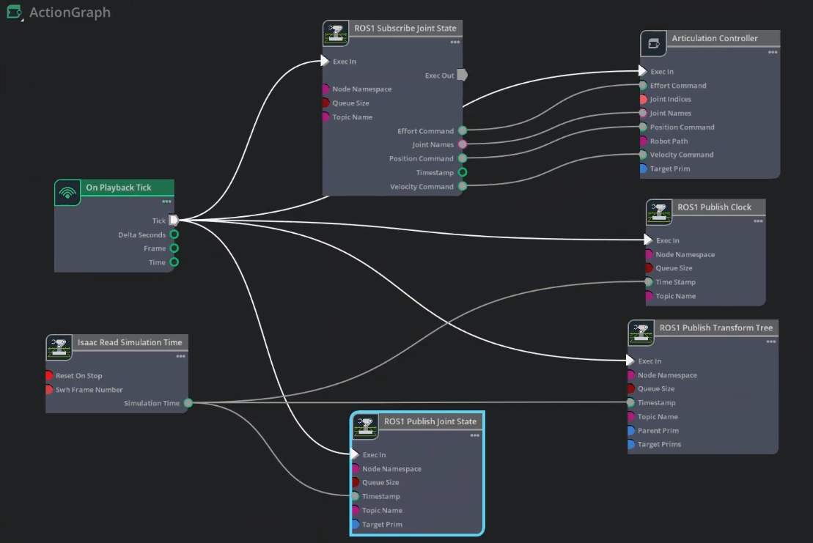

# Isaac Sim 4.5 与 MoveIt 通信教程  
## ——以 UR10e 机械臂为例

本项目实现了一套基于 **ROS Noetic** 与 **NVIDIA Isaac Sim 4.5** 的数字孪生系统，核心目标是通过 **MoveIt** 进行路径规划，并在 Isaac Sim 物理仿真环境中同步执行。

---

## 1. 项目核心目标

核心目标是：

> 在 **Isaac Sim 4.5** 中加载机械臂 USD 模型，同时通过 **ROS Noetic + MoveIt** 完成机械臂运动规划，并将 MoveIt 规划出的关节轨迹发送给 Isaac Sim 执行，从而实现 Isaac Sim 与 MoveIt 之间的通信联动。

整体通信链路可以理解为：

```text
MoveIt / RViz
    ↓
规划机械臂关节轨迹
    ↓
ROS Topic / JointState
    ↓
Python 通信脚本解析关节状态
    ↓
转换为 Isaac Sim 可执行的关节目标
    ↓
Isaac Sim 中的机械臂执行动作
```

也可以简单理解为：

```text
MoveIt 负责规划
Python 脚本负责中转
Isaac Sim 负责执行
```

---

## 2. 项目结构

建立如下所示的项目：

```text
ISAACSIM_MOVEIT/
├── .vscode/
│   └── VSCode 配置文件
│
├── doc/
│   └── 项目说明文档、笔记、配置说明等
│
├── launch/
│   └── ur10e_isaac_execution.launch     // ROS 的 launch 启动文件
│
├── ros_ws/                              // 存放 ROS 相关功能包
│   ├── build/
│   ├── devel/
│   ├── src/
│   │   └── ur_robot_noetic/             // 官方 UR 系列功能包
│   └── CMakeLists.txt
│
├── scripts/
│   └── ur10e_combined_joints_publisher.py  // 通信中转脚本
│
└── sim_ws/                            // 存放 Isaac Sim 相关文件
    ├── config/
    └── usd/                                // 存放 USD 文件
```

---

## 3. `ros_ws` 说明

`ros_ws` 是 ROS Noetic 工作空间，主要用于存放 UR 机械臂相关 ROS 功能包和 MoveIt 配置包。

在 `src` 下存放官方的 UR 系列功能包，下载链接为：

```text
https://github.com/ros-industrial/universal_robot
```

下载后可以修改功能包名称，例如：

```text
ur_robot_noetic
```


其中比较重要的功能包包括：

| 功能包 | 作用 |
|---|---|
| `ur_description` | 存放 UR 系列机械臂的 URDF / xacro 模型 |
| `ur10e_moveit_config` | 存放 UR10e 的 MoveIt 配置文件 |
| `ur_kinematics` | 存放 UR 机械臂运动学相关配置 |
| `ur_gazebo` | Gazebo 仿真相关内容，本项目中不是重点 |

---

### 3.1 编译 ROS 工作空间

进入 `ros_ws` 目录：

```bash
cd ~ros_ws
```

执行编译：

```bash
catkin_make
```

编译成功后，加载 ROS 工作空间环境变量：

```bash
source devel/setup.bash
```

如果希望每次打开终端自动加载，可以写入 `~/.bashrc`：

```bash
echo "source ~/ISAACSIM_MOVEIT/ros_ws/devel/setup.bash" >> ~/.bashrc
source ~/.bashrc
```

启动 UR10e 的 MoveIt demo：

```bash
roslaunch ur10e_moveit_config demo.launch
```

如果成功加载出 UR10e 的 RViz 模型，则说明 MoveIt 配置基本正常，可以继续下一步。

表示启动 `ur10e_moveit_config` 功能包下的 `demo.launch` 文件。

---

### 3.2 MoveIt 中需要检查的内容

启动 RViz 后，需要重点检查以下内容：

● UR10e 模型是否正常显示  
● MotionPlanning 插件是否正常加载  
● Planning Group 是否正确  
● 末端目标点是否可以拖动  
● 点击 `Plan` 是否可以规划成功  
● 点击 `Execute` 是否可以产生执行轨迹  
● `/joint_states` 是否有数据输出  
● `/move_group/fake_controller_joint_states` 是否有数据输出  

查看话题列表：

```bash
rostopic list
```

查看关节状态：

```bash
rostopic echo /joint_states
```

查看 MoveIt fake controller 输出：

```bash
rostopic echo /move_group/fake_controller_joint_states
```

如果 `/move_group/fake_controller_joint_states` 有数据，说明 MoveIt 在虚拟执行时能够输出规划后的关节状态。

---

## 4. `sim_ws` 说明

`sim_ws` 文件夹用于存放 **Isaac Sim 侧相关文件**，主要包括机器人 USD 模型、Isaac Sim 场景文件、Action Graph 配置说明以及与 ROS 通信相关的参数文件。


### 4.1 Isaac Sim 中加载 USD 模型

打开 Isaac Sim 4.5 后，执行以下步骤：

```text
1. 新建空场景
2. 导入 sim_ws/usd/ 下的 UR10e USD 模型
3. 检查机器人是否正常显示
4. 检查机器人是否具有 Articulation Root
5. 检查关节名称是否与 ROS / MoveIt 一致
6. 检查机器人 prim 路径是否正确
7. 配置 Action Graph 通信节点
8. 保存 Isaac Sim 场景
```

● 建议将机器人放在 Isaac Sim 的如下路径下：

```text
/World/UR10e
```

● 建议将Action Graph放在 Isaac Sim 的如下路径下：
```text
/World/Action Graph
```
如果路径不一致，Isaac Sim 就无法正确控制机械臂或发布机械臂状态。

●  **新建Action Graph步骤为:** 

```text
Window > Graph Editors > Action Graph
```
此时，屏幕下方或侧边会弹出 Action Graph 的编辑器面板。
点击 New Action Graph 按钮。此时会弹出一个对话框，要求你指定该 Graph 的路径：

建议路径：**/World/ActionGraph**


---

### 4.2 启用 ROS1 Bridge

由于本项目使用的是：ROS Noetic，因此 Isaac Sim 中应启用 ROS1 Bridge。

按照以下步骤启用：

```text
Window
    ↓
Extensions
    ↓
搜索 ROS Bridge
    ↓
启用 ROS1 Bridge
```

---

### 4.3 Action Graph 的作用

本项目中，Isaac Sim 侧通过 **Action Graph** 完成 ROS 与 Isaac Sim 的通信。

Action Graph 的主要作用包括两部分：

```text
第一部分：ROS → Isaac Sim
接收 ROS 中的 /joint_command 话题，
并将关节目标发送给 Articulation Controller，
驱动 Isaac Sim 中的 UR10e 机械臂运动。
```

```text
第二部分：Isaac Sim → ROS
将 Isaac Sim 中的仿真时间、关节状态和 TF 坐标树发布给 ROS，
用于 RViz / MoveIt 显示和状态同步。
```

因此，Action Graph 是一个 **双向通信结构**：

---

### 4.4 当前 Action Graph 节点组成

本项目构建了一个通用的简单的Action Graph，如图所示：

当前 Action Graph 主要包含以下节点：

```text
On Playback Tick
Isaac Read Simulation Time
ROS1 Subscribe Joint State
Articulation Controller
ROS1 Publish Clock
ROS1 Publish Joint State
ROS1 Publish Transform Tree
```

各节点作用如下：

| 节点 | 作用 |
|---|---|
| `On Playback Tick` | Isaac Sim 点击 Play 后，每个仿真周期触发一次执行信号 |
| `Isaac Read Simulation Time` | 读取 Isaac Sim 当前仿真时间 |
| `ROS1 Subscribe Joint State` | 订阅 ROS 侧发布的 `/joint_command` 关节命令 |
| `Articulation Controller` | 根据关节命令驱动 Isaac Sim 中的机械臂运动 |
| `ROS1 Publish Clock` | 向 ROS 发布 Isaac Sim 仿真时间 `/clock` |
| `ROS1 Publish Joint State` | 向 ROS 发布 Isaac Sim 中机械臂当前关节状态 `/joint_states` |
| `ROS1 Publish Transform Tree` | 向 ROS 发布 Isaac Sim 中机器人的 TF 坐标树 `/tf` |

---

### 4.5 Action Graph 的输入控制链路

第一条链路是 **ROS 控制 Isaac Sim**。

其作用是：

```text
接收 MoveIt 规划后的关节目标，
并驱动 Isaac Sim 中的 UR10e 机械臂运动。
```

链路如下：

```text
MoveIt / RViz
    ↓
/move_group/fake_controller_joint_states
    ↓
topic_tools relay
    ↓
/joint_command_desired
    ↓
ur10e_combined_joints_publisher.py
    ↓
/joint_command
    ↓
ROS1 Subscribe Joint State
    ↓
Articulation Controller
    ↓
UR10e USD Robot
```


### 4.6 Action Graph 关键参数配置

当前 Action Graph 中各节点建议配置如下：

| 节点 | 关键参数 | 建议配置 |
|---|---|---|
| `ROS1 Subscribe Joint State` | `Topic Name` | `/joint_command` |
| `ROS1 Subscribe Joint State` | `Queue Size` | `1` |
| `Articulation Controller` | `Target Prim` | `/World/UR10e` |
| `ROS1 Publish Clock` | `Topic Name` | `/clock` |
| `ROS1 Publish Joint State` | `Topic Name` | `/joint_states` |
| `ROS1 Publish Joint State` | `Target Prim` | `/World/UR10e` |
| `ROS1 Publish Transform Tree` | `Topic Name` | `/tf` |
| `ROS1 Publish Transform Tree` | `Target Prims` | `/World/UR10e` |
| `Isaac Read Simulation Time` | `Simulation Time` | 连接到 Clock、Joint State、TF 的 Timestamp |
| `On Playback Tick` | `Tick` | 连接到所有需要周期执行的节点 |

需要重点注意：

```text
Articulation Controller 的 Target Prim
ROS1 Publish Joint State 的 Target Prim
ROS1 Publish Transform Tree 的 Target Prims
```

这几个路径必须与 Isaac Sim Stage 中机器人实际路径一致。

---

### 4.7 Action Graph 对应 ROS 话题

当前 Action Graph 对应的 ROS 话题关系如下：

| ROS 话题 | 方向 | 作用 |
|---|---|---|
| `/joint_command` | ROS → Isaac Sim | Python 中转脚本发送给 Isaac Sim 的最终关节命令 |
| `/clock` | Isaac Sim → ROS | Isaac Sim 发布仿真时间 |
| `/joint_states` | Isaac Sim → ROS | Isaac Sim 发布当前机械臂关节状态 |
| `/tf` | Isaac Sim → ROS | Isaac Sim 发布机器人 TF 坐标树 |
| `/move_group/fake_controller_joint_states` | MoveIt → ROS | MoveIt fake controller 输出的虚拟关节状态 |
| `/joint_command_desired` | ROS 内部中转 | relay 转发后的期望关节命令 |


---

### 4.8 配置完成后的检查方法

配置完成后，需要检查 ROS 和 Isaac Sim 两侧是否都正常。

首先检查 ROS 侧是否有最终关节命令：

```bash
rostopic echo /joint_command
```

如果 `/joint_command` 有数据，说明 Python 中转脚本已经正常发布关节命令。

然后检查 Isaac Sim 是否发布仿真时间：

```bash
rostopic echo /clock
```

检查 Isaac Sim 是否发布关节状态：

```bash
rostopic echo /joint_states
```

检查 Isaac Sim 是否发布 TF：

```bash
rostopic echo /tf
```

也可以查看 TF 树：

```bash
rosrun rqt_tf_tree rqt_tf_tree
```

如果 `/joint_command` 有数据，但是 Isaac Sim 中机械臂不动，优先检查：

```text
1. Isaac Sim 是否点击了 Play
2. ROS1 Bridge 是否启用
3. ROS1 Subscribe Joint State 的 Topic Name 是否为 /joint_command
4. Articulation Controller 的 Target Prim 是否正确
5. UR10e USD 模型是否具有 Articulation Root
6. /joint_command 中的 joint_names 是否与 USD 中关节名称一致
```

---

### 4.9 保存 Isaac Sim 场景

Action Graph 配置完成后，保存 Isaac Sim 场景文件，避免每次重新配置。

可以保存为：

```text
sim_ws/usd/ur10e_isaac_moveit_scene.usd
```
用于保存完整仿真场景，包括：

● UR10e USD 模型  
● Action Graph  
● ROS1 Bridge 通信配置  
● 场景环境  
● 光源与相机配置  

---


## 5. `ur10e_combined_joints_publisher.py` 说明

这个脚本的核心作用是：

```text
订阅 MoveIt 规划得到的轨迹或虚拟执行关节状态
    ↓
解析 JointState 中的 name 和 position
    ↓
使用字典缓存所有关节的最新状态
    ↓
将完整关节状态发布给 Isaac Sim
    ↓
Isaac Sim 根据 /joint_command 驱动机械臂运动
```

在本项目中，该脚本相当于 MoveIt 与 Isaac Sim 之间的 **通信中转站**。

---

### 5.1 为什么需要中转脚本

需要一个 Python 脚本完成：

```text
/move_group/fake_controller_joint_states
    ↓
/joint_command_desired
    ↓
ur10e_combined_joints_publisher.py
    ↓
/joint_command
    ↓
Isaac Sim Action Graph
```

其中：

| 话题 | 作用 |
|---|---|
| `/move_group/fake_controller_joint_states` | MoveIt 虚拟执行输出的关节状态 |
| `/joint_command_desired` | 中间期望关节命令话题 |
| `/joint_command` | 发送给 Isaac Sim 的最终关节命令话题 |

---

### 5.2 `ur10e_combined_joints_publisher.py` 文件

```python
#!/usr/bin/env python3

import rospy
from sensor_msgs.msg import JointState

# 定义全局字典用于缓存关节状态。
# 即使 MoveIt 只发布了部分正在移动的关节，该字典也能确保发给 Isaac Sim 的是完整的全身指令。
joints_dict = {}

def joint_states_callback(message):
    joint_commands = JointState()
    joint_commands.header = message.header

    # 遍历接收到的 JointState 消息，更新对应关节在字典中的位置数值。
    for i, name in enumerate(message.name):
        joints_dict[name] = message.position[i]

        # 处理镜像关节或关联关节（Mimic Joints）。
        # 如果未来添加了双指夹爪（如 Robotiq），可在此处让从动关节自动同步主动关节的数值。
        # 例如：
        # if name == "finger_joint_1":
        #     joints_dict["finger_joint_2"] = message.position[i]

    # 从字典中提取所有的关节名称和对应的位置数值并转换为列表。
    # 这能保证发布的控制指令始终包含机器人当前已知的全部关节状态。
    joint_commands.name = list(joints_dict.keys())
    joint_commands.position = list(joints_dict.values())

    # 将合并后的完整关节消息发布给 Isaac Sim 的 Action Graph 节点。
    pub.publish(joint_commands)

if __name__ == "__main__":
    # 初始化 ROS 节点。
    rospy.init_node("ur10e_combined_joints_publisher")
    
    # 定义发布者：向 Isaac Sim 的 /joint_command 话题发送指令。
    pub = rospy.Publisher("/joint_command", JointState, queue_size=1)
    
    # 定义订阅者：接收来自 MoveIt 规划器的 /joint_command_desired 期望位置信号。
    rospy.Subscriber("/joint_command_desired", JointState, joint_states_callback, queue_size=1)
    
    rospy.loginfo("UR10e 通信中枢已准备就绪...")
    rospy.spin()
    
    
    
# 两者之间的关系：中转站
# 在项目中，ur10e_combined_joints_publisher.py 脚本就充当了这两个话题之间的"翻译官"和"中转站"：
#
# 订阅 /joint_command_desired：获取 MoveIt 发出的局部或最新的目标。
#
# 字典缓存处理：通过 joints_dict 记忆所有关节的状态，确保指令的完整性。
#
# 发布到 /joint_command：将汇总后的、包含全身关节数据的完整指令发送给 Isaac Sim，驱动机器人运动。
```

---

---

## 6. `ur10e_isaac_execution.launch` 说明

该部分用于一键启动 ROS 相关节点，主要包括：

● 启用仿真时间  
● 启动 Python 通信中转脚本  
● 加载 UR10e 的 MoveIt 规划上下文  
● 将 MoveIt fake controller 的关节状态转发到 `/joint_command_desired`  
● 启动 MoveGroup 核心节点  
● 启动 RViz 可视化界面  
● 发布必要的静态 TF 坐标变换  

---

### 6.1 launch 文件代码

```xml
<launch>
  <!-- 启用仿真时间 -->
  <param name="use_sim_time" value="true" />

  <!-- 1. 启动数据转换脚本（通过我们在包里建立的软链接） -->
  <node pkg="ur10e_moveit_config" name="ur10e_combined_joints_publisher" type="ur10e_combined_joints_publisher.py" />

  <!-- 2. 加载 UR10e 的 MoveIt 规划上下文 -->
  <include file="$(find ur10e_moveit_config)/launch/planning_context.launch">
    <arg name="load_robot_description" value="true"/>
  </include>

  <!-- 3. 话题中转：将 MoveIt 的虚拟轨迹输出转发给转换脚本 -->
  <node name="joint_command_publisher" pkg="topic_tools" type="relay" args="/move_group/fake_controller_joint_states /joint_command_desired" />
  
  <!-- 4. 启动 MoveGroup 核心节点 -->
  <include file="$(find ur10e_moveit_config)/launch/move_group.launch">
    <arg name="allow_trajectory_execution" value="true"/>
    <!-- 修正点：使用 fake_execution 替代 moveit_controller_manager -->
    <arg name="fake_execution" value="true"/> 
    <arg name="info" value="true"/>
  </include>

  <!-- 5. 启动 RViz -->
  <node name="rviz" pkg="rviz" type="rviz" args="-d $(find ur10e_moveit_config)/launch/moveit.rviz" />

  <!-- 6. 模拟静态发布点 -->
  <node pkg="tf" type="static_transform_publisher" name="base_link_to_base" args="0 0 0 0 0 0 base_link base 100" />

  <node pkg="tf" type="static_transform_publisher" name="wrist_3_to_flange" args="0 0 0 0 0 0 wrist_3_link flange 100" />

  <node pkg="tf" type="static_transform_publisher" name="flange_to_tool0" args="0 0 0 0 0 0 flange tool0 100" />

  <node pkg="tf" type="static_transform_publisher" name="base_link_to_inertia" args="0 0 0 0 0 0 base_link base_link_inertia 100" />
</launch>
```

---

### 6.2 launch 重要部分解释

#### 1 启用仿真时间

```xml
<param name="use_sim_time" value="true" />
```

该参数表示 ROS 系统使用仿真时间。

在 Isaac Sim、Gazebo 等仿真环境中，通常需要开启：

```text
use_sim_time = true
```

这样 ROS 节点可以与仿真环境时间保持一致。

---

#### 2 启动通信中转脚本

```xml
<node pkg="ur10e_moveit_config" name="ur10e_combined_joints_publisher" type="ur10e_combined_joints_publisher.py" />
```

该节点用于启动：

```text
ur10e_combined_joints_publisher.py
```

作用是：

```text
订阅 /joint_command_desired
发布 /joint_command
```

也就是将 MoveIt 侧的关节状态转换为 Isaac Sim 可以接收的关节控制命令。

---


#### 3 发布静态 TF

```xml
<node pkg="tf" type="static_transform_publisher" name="base_link_to_base" args="0 0 0 0 0 0 base_link base 100" />
```

这些静态 TF 的作用是补齐 ROS / MoveIt 中可能需要的坐标系，使 TF 树保持完整。

例如：

```text
base_link → base
wrist_3_link → flange
flange → tool0
base_link → base_link_inertia
```

如果 RViz 中出现某些 frame 缺失，可以通过静态 TF 临时补齐。

---

## 7. 启动步骤

### 7.1 第一步：启动 roscore

打开第一个终端：

```bash
roscore
```

该命令用于启动 ROS Master，是 ROS 节点通信的基础。

---

### 7.2 第二步：加载 ROS 工作空间

打开第二个终端：

```bash
cd ros_ws
source devel/setup.bash
```

如果已经写入 `~/.bashrc`，则可以不用每次手动 source。

---

### 7.3 第三步：启动 Isaac Sim 4.5

打开 Isaac Sim 4.5，加载 UR10e 的 USD 模型，例如：

```text
~/ISAACSIM_MOVEIT/sim_ws/usd/ur10e_robot.usd
```

在 Isaac Sim 中确认：

● 机器人模型已经加载  
● 机器人 prim 路径正确  
● Articulation Root 正确  
● ROS Bridge 已启用  
● Action Graph 已经建立  
● Action Graph 订阅的话题为 `/joint_command`  

---

### 7.4 第四步：启动 ROS 侧 launch 文件

在第二个终端中执行：

```bash
cd isaacsim_moveit
```

```bash
roslaunch ./launch/ur10e_isaac_execution.launch
```

---

### 7.5 第五步：检查 ROS 话题

启动后检查话题：

```bash
rostopic list
```

重点查看是否存在：

```text
/joint_states
/joint_command
/joint_command_desired
/move_group/fake_controller_joint_states
/tf
/tf_static
```

查看 MoveIt 输出：

```bash
rostopic echo /move_group/fake_controller_joint_states
```

查看中转话题：

```bash
rostopic echo /joint_command_desired
```

查看发送给 Isaac Sim 的最终话题：

```bash
rostopic echo /joint_command
```

---

### 7.6 第六步：在 RViz 中规划执行

在 RViz 中执行以下操作：

```text
1. 在 MotionPlanning 面板中选择 Planning Group
2. 拖动末端执行器目标点
3. 点击 Plan
4. 如果轨迹规划成功，点击 Execute
5. 观察 Isaac Sim 中 UR10e 是否同步运动
```

如果 Isaac Sim 中机械臂能够跟随 RViz / MoveIt 的执行结果同步运动，说明通信链路建立成功。

---

## 8. 整体通信逻辑总结

本项目的整体通信逻辑如下：

```text
RViz / MoveIt
    ↓
用户拖动目标点并点击 Plan / Execute
    ↓
MoveIt 进行运动规划
    ↓
fake_controller 输出虚拟执行关节状态
    ↓
/move_group/fake_controller_joint_states
    ↓
topic_tools relay
    ↓
/joint_command_desired
    ↓
ur10e_combined_joints_publisher.py
    ↓
/joint_command
    ↓
Isaac Sim Action Graph
    ↓
UR10e USD 机械臂同步运动
```

可以进一步总结为：

```text
MoveIt 产生目标关节状态
Python 脚本整理完整关节命令
Isaac Sim 执行关节命令
```

---
