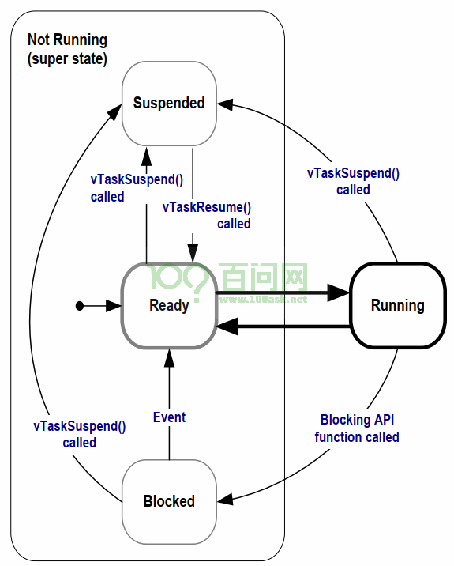

## 任务状态

在 FreeRTOS 中，任务并不是一直都在运行，而是会在不同状态之间切换。  
任务状态反映了任务当前是否正在执行、是否具备运行条件，或者是否因为某些原因暂时不能运行。

理解任务状态，是学习任务管理和任务调度的基础。

---

## 1 运行态

运行态表示任务当前正在占用 CPU 执行。

对于单核单片机系统来说，同一时刻只能有一个任务处于运行态。  
也就是说，虽然系统中可以有多个任务，但某一时刻真正执行的只有一个。

---

## 2 就绪态

就绪态表示任务已经具备运行条件，只是在等待 CPU。

处于就绪态的任务说明：

- 它可以运行
- 它没有被阻塞
- 它没有被挂起
- 只是当前 CPU 正在执行别的任务

当调度器选择到它时，它就会从就绪态切换到运行态。

---

## 3 阻塞态

阻塞态表示任务因为等待某个事件，暂时不能运行。

例如：

- 调用了延时函数
- 等待队列数据
- 等待信号量
- 等待事件标志组
- 等待某个外设操作完成

在阻塞态下，任务不会参与 CPU 的竞争。  
只有当等待的条件满足后，任务才会重新进入就绪态。

---

## 4 挂起态

挂起态表示任务被人为暂停，不参与调度。

通常是通过任务控制函数把任务挂起，例如调用挂起函数后，任务就会进入挂起态。  
挂起态和阻塞态的区别在于：

- 阻塞态是任务在等待某个事件
- 挂起态是任务被主动暂停

处于挂起态的任务，即使等待条件满足，也不会自动运行，必须被恢复后才能重新参与调度。

---

## 5 任务状态切换的基本过程

FreeRTOS 中任务状态会随着系统运行不断变化，常见过程如下：

- 任务创建后，先进入就绪态
- 调度器选中后，进入运行态
- 调用延时函数或等待事件后，进入阻塞态
- 阻塞结束后，重新进入就绪态
- 被挂起后，进入挂起态
- 被恢复后，再进入就绪态

因此，任务状态并不是固定不变的，而是会根据任务行为和系统调度不断切换。

---

## 6 插入任务状态完整转换图

这里是任务状态的完整状态转换图：

---

## 7 小结

FreeRTOS 中常见的任务状态主要有 4 种：

- 运行态
- 就绪态
- 阻塞态
- 挂起态

其中：

- 运行态表示任务正在执行
- 就绪态表示任务可以运行，只是在等待 CPU
- 阻塞态表示任务因为等待事件暂时不能运行
- 挂起态表示任务被人为暂停，不参与调度

任务状态的变化过程，体现了 FreeRTOS 对任务运行过程的管理，也是理解任务调度机制的重要基础。